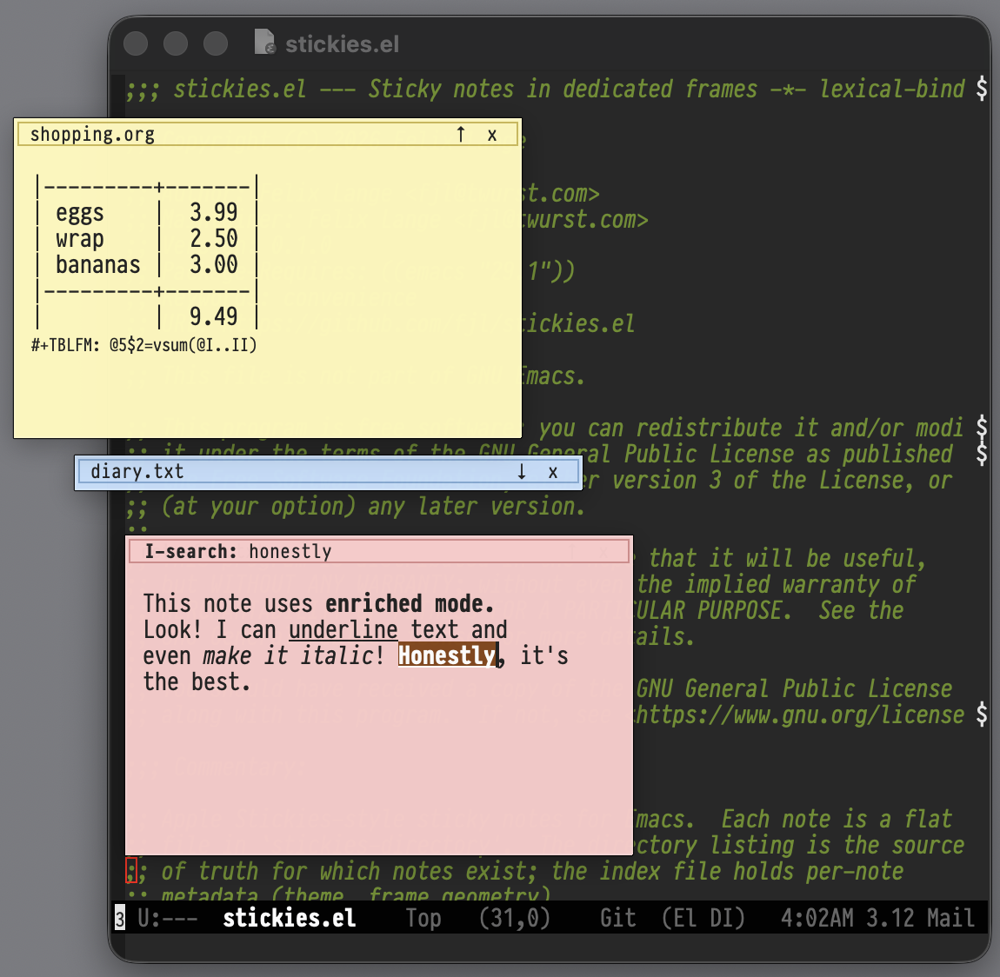

# stickies.el — sticky notes in dedicated frames

Pastel-colored panes of text that auto-saves, floating above other application windows.
Creating a new note doesn't ask for a file name, a commitment-free writing space. Note
frames can collapse into a title-bar to hide their content.

Heavily inspired by Apple's Stickies.app, this package provides a similar experience, but
the notes are just text files stored in a directory. And you can use any Emacs mode for
the content. Org-mode checklists, spreadsheets, enriched-mode, inline images...



## Commands

- `stickies-new` — create a new note.
- `stickies-open` — open an existing note by name.
- `stickies-toggle` — show all notes, or hide them if a note is focused.
- `stickies-show-all` / `stickies-hide-all` — show or hide every note.
- `stickies-rename` — rename the current note.
- `stickies-delete` — delete the current note on disk (asks for confirmation).
- `stickies-set-theme` — set the current note's color theme.

## Installation

At this time, stickies.el is not yet available in MELPA or any other repository.
So you have to acquire it somehow and then load it in your Emacs configuration:

```elisp
(require 'stickies)
```

I recommend binding at least `stickies-new` and `stickies-toggle` to easily-reachable
keys. Since stickies is GUI-only anyway, you can use super-keys:

```elisp
(keymap-global-set "s--" 'stickies-new)
(keymap-global-set "s-+" 'stickies-toggle)
```

